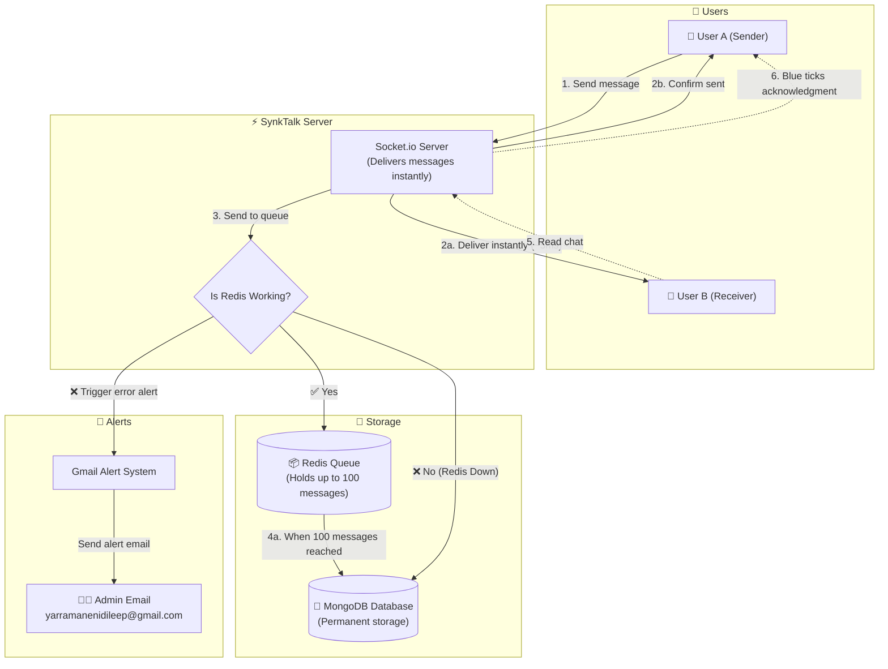

# ⚡ SynkTalk

[](https://synk-talk.vercel.app/)
[](https://github.com/dileep812/synkTalk/actions/workflows/ci.yml)

**SynkTalk** is a fast real-time chat application built with **React**, **Node.js/Express**, **Socket.io**, **Redis**, and **MongoDB**. 

It delivers instant messages in under **10ms** by saving messages in a fast **Redis memory queue** first, and saving them into **MongoDB** only when 100 messages are reached. If Redis fails, messages are saved directly to MongoDB without losing any data.

---

## 📊 How It Works (Message Flow)


```mermaid
flowchart TD
    subgraph Users["👥 Users"]
        A["👤 User A (Sender)"]
        B["👤 User B (Receiver)"]
    end

    subgraph App["⚡ SynkTalk Server"]
        Socket["Socket.io Server\n(Delivers messages instantly)"]
        Check{"Is Redis Working?"}
    end

    subgraph Data["💾 Storage"]
        Redis[("📦 Redis Queue\n(Holds up to 100 messages)")]
        Mongo[("🍃 MongoDB Database\n(Permanent storage)")]
    end

    subgraph Alerts["📧 Alerts"]
        Email["Gmail Alert System"]
        Admin["👨‍💻 Admin Email\nyarramanenidileep@gmail.com"]
    end

    %% Flow Steps
    A -->|"1. Send message"| Socket
    Socket -->|"2a. Deliver instantly (~5ms)"| B
    Socket -->|"2b. Confirm sent"| A
    Socket -->|"3. Send to queue"| Check

    %% Normal Path
    Check -->|"✅ Yes"| Redis
    Redis -->|"4a. When 100 messages reached"| Mongo

    %% Failure Fallback
    Check -->|"❌ No (Redis Down)"| Mongo
    Check -->|"❌ Trigger error alert"| Email
    Email -->|"Send alert email"| Admin

    %% Read Receipts
    B -.->|"5. Read chat"| Socket
    Socket -.->|"6. Blue ticks acknowledgment"| A
```

---

## 🔍 How Each Case Works (Simple Explanation)

### 1. Sending Messages (Normal Mode)
* **Instant Delivery**: When User A sends a message, User B receives it in **~5ms** over WebSockets.
* **Redis Queue**: The message is placed in the Redis list (`chat:message_queue`).
* **Batch Save (100 Messages)**: Messages stay in Redis until **100 messages** accumulate. Once 100 messages are reached, the server saves all 100 messages into MongoDB in a single fast write.

### 2. If Redis Fails (Fallback Mode)
* **Direct Save**: If Redis goes down or disconnects, the server immediately saves the message directly into MongoDB.
* **Email Alert**: The system automatically sends an email to **`yarramanenidileep@gmail.com`** to notify the admin.
* **No Lost Messages**: Chatting continues without any interruption or lost messages.

### 3. Ticks & Read Receipts in Redis
* **Single Tick (`✓ Sent`)**: The message is sent and stored in the Redis queue.
* **Double White Ticks (`✓✓ Delivered`)**: Updated directly in Redis as soon as the recipient receives the message or logs back in.
* **Double Blue Ticks (`✓✓ Read`)**: When User B opens the chat, the message status is updated to `"read"` inside both Redis and MongoDB in real time.

### 4. Active / Online Status
* **Green Dot / Active Now**: Shows when friends are currently online.
* **Typing Indicator**: Shows live `"Typing..."` animation when the other person is typing.

---

## 🛠️ Tech Stack

* **Frontend**: React
* **Backend**: Node.js, Express, Socket.io
* **Queue / Cache**: Redis
* **Database**: MongoDB (Mongoose)
* **Testing**: Jest (19 automated unit & integration tests)

---

## 🚀 How to Run Locally

### 1. Install Dependencies
```bash
# Backend
cd backend && npm install

# Frontend
cd ../frontend && npm install
```

### 2. Add Environment Variables
Create `.env` files in both `backend` and `frontend` folders using the `.env.example` templates.

### 3. Start Development Servers
```bash
# Start backend server (Port 5000)
cd backend && npm run dev

# Start frontend app (Port 5173)
cd ../frontend && npm run dev
```

### 4. Run Tests
```bash
cd backend && npm test
```
