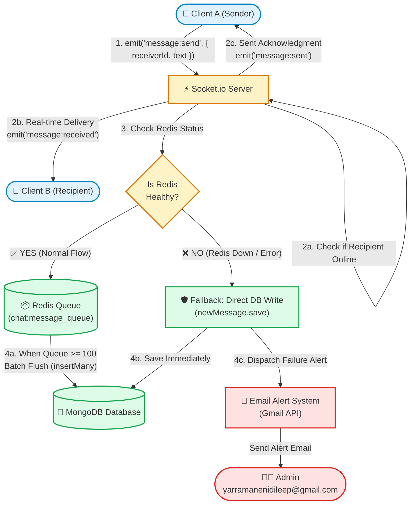

# ⚡ SynkTalk

**SynkTalk** is a real-time messaging platform built with **React**, **Node.js/Express**, **Socket.io**, **Redis**, and **MongoDB**. It delivers sub-10ms chat messages using an asynchronous Redis write-behind queue with automatic direct database fallback and email alerts.

---

## 📊 End-to-End Message Flow Diagram

The diagram below covers all real-time messaging scenarios, fallback mechanisms, and user presence flows:


```mermaid
flowchart TD
    %% Entities
    Sender(["👤 Client A (Sender)"])
    Receiver(["👤 Client B (Recipient)"])
    SocketServer["⚡ Socket.io Server"]
    RedisQueue[("📦 Redis Queue\n(chat:message_queue)")]
    MongoDB[("🍃 MongoDB Database")]
    EmailService["📧 Email Alert System\n(Gmail API)"]
    Admin(["👨‍💻 Admin\nyarramanenidileep@gmail.com"])

    %% 1. Send Message
    Sender -->|"1. emit('message:send', { receiverId, text })"| SocketServer

    %% 2. Check Presence & Deliver
    SocketServer -->|"2a. Check if Recipient Online"| SocketServer
    SocketServer -->|"2b. Real-time Delivery\nemit('message:received')"| Receiver
    SocketServer -->|"2c. Sent Acknowledgment\nemit('message:sent')"| Sender

    %% 3. Persistence Routing (Conditional)
    SocketServer -->|"3. Check Redis Status"| CheckRedis{"Is Redis\nHealthy?"}

    %% Case A: Normal Redis Flow
    CheckRedis -->|"✅ YES (Normal Flow)"| RedisQueue
    RedisQueue -->|"4a. When Queue >= 100\nBatch Flush (insertMany)"| MongoDB

    %% Case B: Redis Failure Fallback
    CheckRedis -->|"❌ NO (Redis Down / Error)"| DirectDB["🛡️ Fallback: Direct DB Write\n(newMessage.save)"]
    DirectDB -->|"4b. Save Immediately"| MongoDB
    DirectDB -->|"4c. Dispatch Failure Alert"| EmailService
    EmailService -->|"Send Alert Email"| Admin

    %% Styling
    classDef client fill:#e0f2fe,stroke:#0284c7,stroke-width:2px;
    classDef server fill:#fef3c7,stroke:#d97706,stroke-width:2px;
    classDef db fill:#dcfce7,stroke:#16a34a,stroke-width:2px;
    classDef alert fill:#fee2e2,stroke:#dc2626,stroke-width:2px;

    class Sender,Receiver client;
    class SocketServer,CheckRedis server;
    class RedisQueue,MongoDB,DirectDB db;
    class EmailService,Admin alert;
```

---

## 🔄 Explanation of Message Cases

### 1️⃣ Normal Flow (Redis Active)
1. **Send**: Sender emits `message:send`.
2. **Instant Delivery**: Server checks recipient presence, delivers the message to Client B via WebSocket (`message:received`), and confirms delivery to Client A (`message:sent`) in **~5ms**.
3. **Queueing**: Message payload is pushed into Redis memory queue (`lPush`).
4. **Batch Sync**: When queue accumulates 100 messages (or on sync), the background worker flushes them in bulk into MongoDB (`insertMany`).

### 2️⃣ Fallback Flow (Redis Offline / Error)
1. **Direct DB Write**: If Redis is offline or push fails, the server catches the exception and immediately saves the message directly into MongoDB (`newMessage.save()`).
2. **Admin Alert**: An automated email notification is sent to **`yarramanenidileep@gmail.com`** via the Gmail API to alert the administrator.
3. **Zero Data Loss**: Message delivery to clients continues smoothly without interruption.

### 3️⃣ Read Receipts (Blue Ticks)
1. When Client B opens the conversation, client emits `message:read_receipt`.
2. Server marks status as `read` in MongoDB and notifies Client A via `messages:marked_read`.

### 4️⃣ Active Presence & Typing Indicators
* **Online/Offline**: Socket connection/disconnection updates active presence across all friends in real time.
* **Typing Status**: `chat:typing` events broadcast live typing animations.

---

## 🚀 Quickstart Guide

### 1. Install Dependencies
```bash
# Backend
cd backend && npm install

# Frontend
cd ../frontend && npm install
```

### 2. Configure Environment
Create `.env` in `backend/` and `frontend/` using provided `.env.example` templates.

### 3. Run Development Servers
```bash
# Start Backend (Port 5000)
cd backend && npm run dev

# Start Frontend (Port 5173)
cd ../frontend && npm run dev
```

### 4. Run Tests
```bash
cd backend && npm test
```
