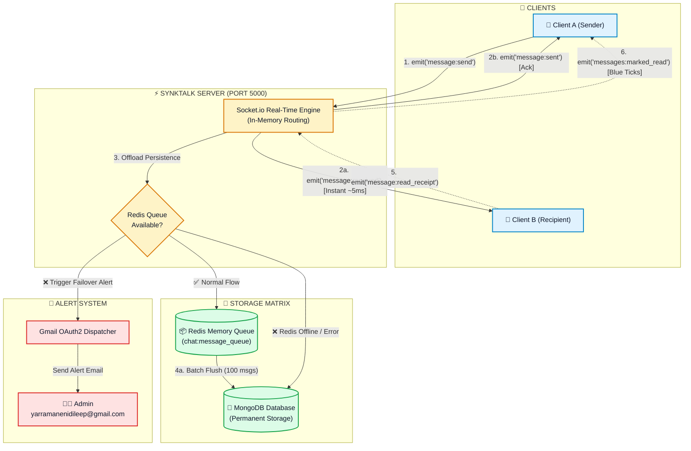

# ⚡ SynkTalk

**SynkTalk** is a real-time, event-driven communication workspace engineered with **React**, **Node.js/Express**, **Socket.io**, **Redis**, and **MongoDB**. It delivers sub-10ms chat messages through an asynchronous memory write-buffer, live presence engine, and automatic MongoDB failover with administrator email alerting.

---

## 🏗️ System Architecture & Message Flow


```mermaid
flowchart TD
    subgraph Clients["👥 CLIENTS"]
        Sender["👤 Client A (Sender)"]
        Receiver["👤 Client B (Recipient)"]
    end

    subgraph Server["⚡ SYNKTALK SERVER (PORT 5000)"]
        SocketEngine["Socket.io Real-Time Engine\n(In-Memory Routing)"]
        HealthCheck{"Redis Queue\nAvailable?"}
    end

    subgraph Storage["💾 STORAGE MATRIX"]
        RedisQueue[("📦 Redis Memory Queue\n(chat:message_queue)")]
        MongoDB[("🍃 MongoDB Database\n(Permanent Storage)")]
    end

    subgraph Notification["📧 ALERT SYSTEM"]
        GmailAPI["Gmail OAuth2 Dispatcher"]
        AdminUser["👨‍💻 Admin\nyarramanenidileep@gmail.com"]
    end

    %% 1. Real-Time Chat Dispatch
    Sender -->|"1. emit('message:send')"| SocketEngine
    SocketEngine -->|"2a. emit('message:received') [Instant ~5ms]"| Receiver
    SocketEngine -->|"2b. emit('message:sent') [Ack]"| Sender

    %% 2. Asynchronous Offloading & Decision Branch
    SocketEngine -->|"3. Offload Persistence"| HealthCheck

    %% Normal Path
    HealthCheck -->|"✅ Normal Flow"| RedisQueue
    RedisQueue -->|"4a. Batch Flush (100 msgs)"| MongoDB

    %% Failover Path
    HealthCheck -->|"❌ Redis Offline / Error"| MongoDB
    HealthCheck -->|"❌ Trigger Failover Alert"| GmailAPI
    GmailAPI -->|"Send Alert Email"| AdminUser

    %% Read Receipts
    Receiver -.->|"5. emit('message:read_receipt')"| SocketEngine
    SocketEngine -.->|"6. emit('messages:marked_read') [Blue Ticks]"| Sender

    %% Styling
    classDef client fill:#e0f2fe,stroke:#0284c7,stroke-width:2px,color:#0f172a;
    classDef server fill:#fef3c7,stroke:#d97706,stroke-width:2px,color:#0f172a;
    classDef storage fill:#dcfce7,stroke:#16a34a,stroke-width:2px,color:#0f172a;
    classDef alert fill:#fee2e2,stroke:#dc2626,stroke-width:2px,color:#0f172a;

    class Sender,Receiver client;
    class SocketEngine,HealthCheck server;
    class RedisQueue,MongoDB storage;
    class GmailAPI,AdminUser alert;
```

---

## 🔄 Core Workflows & Scenarios

### 1️⃣ Real-Time Messaging (Normal Mode)
* **Sub-5ms Latency**: Client A sends a message. The server checks recipient presence and broadcasts the payload to Client B immediately in-memory without waiting for disk writes.
* **Write-Behind Buffer**: Message is pushed into the Redis queue (`chat:message_queue`).
* **Batch Flush**: When the queue accumulates 100 messages, the background worker bulk-inserts them into MongoDB in a single database roundtrip.

### 2️⃣ Redis Failure & Automatic Database Direct Write
* **Zero Data Loss**: If Redis becomes unreachable or an enqueue error occurs, the server catches the exception and immediately persists the message directly into MongoDB (`newMessage.save()`).
* **Admin Alert**: An automated notification email is sent to **`yarramanenidileep@gmail.com`** via the Gmail API.

### 3️⃣ Read Receipts (Blue Ticks) & Delivery Status
* **Redis & DB Synchronization**: When Client B reads a chat, `message:read_receipt` updates in-flight messages in Redis and persisted messages in MongoDB simultaneously, immediately firing blue tick acknowledgments (`messages:marked_read`) to Client A.
* **Offline Catch-Up**: When an offline user connects, all pending messages are marked `delivered`.

### 4️⃣ Real-Time Presence & Typing Indicators
* **Live Roster**: Server tracks active WebSocket sessions and broadcasts `user:online`, `user:offline`, and `users:online_list`.
* **Typing Animation**: `chat:typing` events broadcast live typing animations with auto-dismiss timers.

---

## 🚀 Quickstart & Production Setup

### 1. Install Dependencies
```bash
# Backend dependencies
cd backend && npm install

# Frontend dependencies
cd ../frontend && npm install
```

### 2. Configure Environment
Set up your `.env` files in both `backend/` and `frontend/`:
```env
# Backend .env
PORT=5000
MONGODB_URI=your_mongodb_connection_string
REDIS_URL=your_redis_connection_string
SESSION_SECRET=your_secret_key
EMAIL_USER=your_email@gmail.com
GMAIL_CLIENT_ID=your_gmail_client_id
GMAIL_CLIENT_SECRET=your_gmail_client_secret
GMAIL_REFRESH_TOKEN=your_gmail_refresh_token
```

### 3. Run Locally
```bash
# Run Backend (Port 5000)
cd backend && npm run dev

# Run Frontend (Port 5173)
cd ../frontend && npm run dev
```

### 4. Run Test Suite
```bash
cd backend && npm test
```

### 5. Production Build
```bash
# Build optimized frontend bundle
cd frontend && npm run build
```
